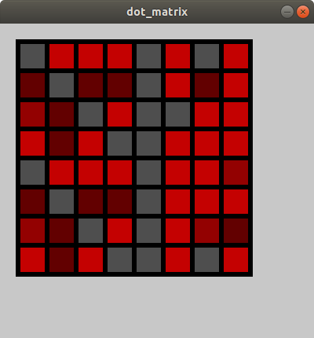

# processing-dot-matrix-simu
Simulate dot matrix looking. Also works for dot-matrix LCD (e.g., 128 x 64). Currently only support single color but can have 255 level of brightness for each pixel.

Programmed with Processing.

